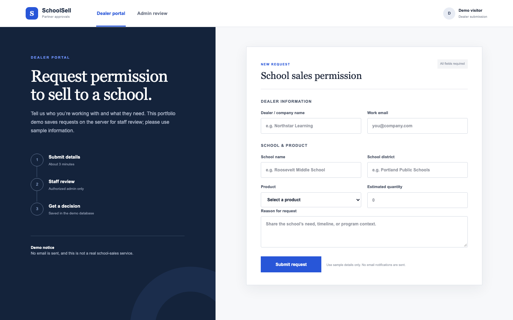

# SchoolSell — dealer approval workflow

A full-stack portfolio extension of a two-view coursework prototype. The original assignment asked for a browser-only dealer form and staff review page. This version adds server-side request storage, API validation, and administrator authorization. It remains a **demo**, not a real school-sales service; use sample information only.

## Demo

[Open the public SchoolSell demo](https://schoolsell-dealer-approval.nicoleliuuuuu.chatgpt.site/). Anyone with the link can try the dealer form using **fictional data only**. The admin tab still requires a signed-in account whose email is configured in the server-side `ADMIN_EMAILS` allowlist; it does not reveal request data to other visitors.



Suggested walkthrough: enter fictional dealer and school details, submit, note the reference number, then sign in as an allowlisted demo administrator to review and approve or deny the pending request. Do not submit real personal or school data. The screenshot above is from the current server-backed version, not the earlier `localStorage` prototype.

## How it works

```text
Dealer form → POST /api/requests → validate → Cloudflare D1
Admin sign-in → platform identity + ADMIN_EMAILS allowlist
              → GET /api/requests → review
              → PATCH /api/requests/:id → saved decision
```

The browser does not hold the authoritative request list. Anonymous visitors can submit a request, but only an allowlisted signed-in administrator can read submissions or approve/deny a pending request. The server rejects repeat decisions and records who made the decision. There is no email delivery.

## Run and test locally

Requires Node.js 22.13+ and pnpm. The production Worker uses a D1 binding named `DB`.

```bash
pnpm install --frozen-lockfile
pnpm test
```

`pnpm test` builds the Worker, type-checks the code, applies the SQL migration to an isolated local D1 database, and checks the public form and authorized/unauthorized API paths. To run the same built Worker manually:

```bash
pnpm run build
WRANGLER_LOG_PATH=.wrangler/wrangler.log pnpm exec wrangler d1 execute dealer-approval-portal-d1 --local --file=drizzle/0000_furry_roland_deschain.sql --config=dist/server/wrangler.json --persist-to=.wrangler/state
WRANGLER_LOG_PATH=.wrangler/wrangler.log pnpm exec wrangler dev --local --config=dist/server/wrangler.json --persist-to=.wrangler/state --var ADMIN_EMAILS:you@example.com
```

The local Wrangler command can simulate the platform-provided identity header for API testing. In production, the Site dispatcher supplies authenticated identity after ChatGPT sign-in; the application compares its email with the server-side `ADMIN_EMAILS` list. Do not trust a user-supplied email field as administrator identity. Configure `ADMIN_EMAILS` as a runtime environment value in Sites before inviting an administrator.

## Data and deployment

The Drizzle schema is in `db/schema.ts`; the generated migration is under `drizzle/`. `.openai/hosting.json` identifies a **dedicated SchoolSell Site** and declares its logical D1 binding. The Site access mode is public, while administrator actions remain restricted by the server-side allowlist. Publishing a commit alone does not update the deployment; confirm the live version and access policy before sharing it as a public demo.

The public form has bounded field lengths and a product allowlist. Admin reads are capped at 200 most recent requests. Production hardening would add rate limiting, abuse prevention, pagination, retention/deletion controls, and a real notification channel. No seeded customer/dealer data is committed to the database, and no email is sent. The earlier browser-only screenshots are not evidence of this server-backed version.

## Coursework provenance

The initial brief was: “Develop a framework for a dealer portal webpage where dealers can submit requests for permission to sell a specific product to a school. Include an admin page where staff can view all incoming requests and approve or deny them. Two simple pages are sufficient; no server or login checks; save all data locally.” The server-backed workflow here is a later portfolio extension, not part of the original assignment requirement.
